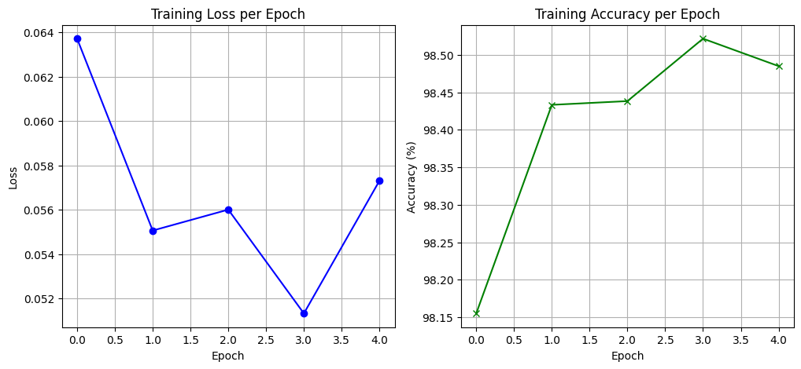

**🧠 SNN MNIST Classifier**

This project implements a Spiking Neural Network (SNN) using the SNNtorch framework to classify handwritten digits from the MNIST dataset. The model is trained using PyTorch and deployed with a Streamlit interface for interactive digit classification.

**🔥 Highlights**
Built using SNNtorch + PyTorch

Achieves ~98.5% accuracy

Live digit classification with Streamlit

Visualises training loss and accuracy

**📊 Training Results**


**🚀 Quickstart**
1. Clone the repository
bash
git clone https://github.com/your-username/snn-mnist-classifier.git
cd snn-mnist-classifier

2. Install dependencies
bash

pip install snntorch torch torchvision matplotlib streamlit pyngrok pillow

3. Train the SNN model
python

python train.py
This trains the model and saves it as snn_mnist.pth.

**🧪 Model Architecture**
<pre> ```import torch
import torch.nn as nn
import snntorch as snn
from snntorch import surrogate

class SNN(nn.Module):
    def __init__(self):
        super().__init__()
        beta = 0.95
        self.fc1 = nn.Linear(28*28, 1000)
        self.lif1 = snn.Leaky(beta=beta, spike_grad=surrogate.fast_sigmoid())
        self.fc2 = nn.Linear(1000, 10)
        self.lif2 = snn.Leaky(beta=beta, spike_grad=surrogate.fast_sigmoid())

    def forward(self, x, num_steps=25):
        mem1 = self.lif1.init_leaky()
        mem2 = self.lif2.init_leaky()
        spk2_rec = []

        for step in range(num_steps):
            cur1 = self.fc1(x)
            spk1, mem1 = self.lif1(cur1, mem1)
            cur2 = self.fc2(spk1)
            spk2, mem2 = self.lif2(cur2, mem2)
            spk2_rec.append(spk2)

        return torch.stack(spk2_rec).sum(dim=0)``` </pre>

**🖥️ Launch Streamlit Web App**
bash
streamlit run app.py
The app allows you to upload a 28x28 grayscale image and classifies it using the trained SNN.

**🌐 Public Deployment (Optional)**
Using ngrok to expose your local Streamlit app:

python

from pyngrok import ngrok
ngrok.set_auth_token("your_token")
public_url = ngrok.connect(addr=8501)
print(public_url)
